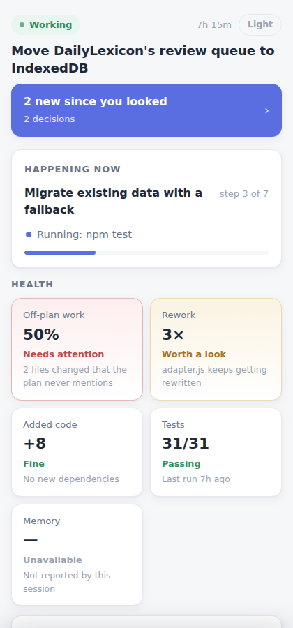
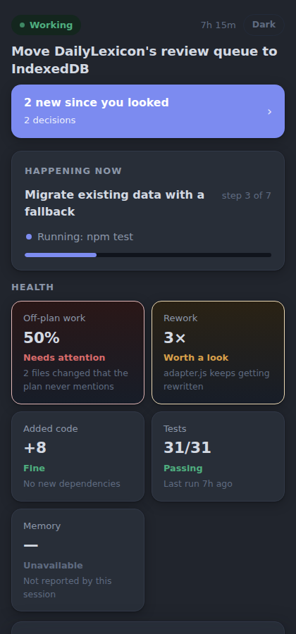
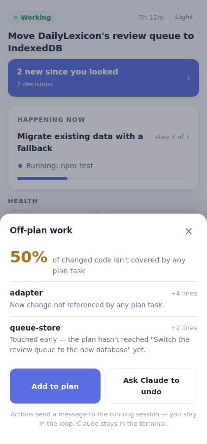

# Attention Router

A local-only dashboard for supervising a running Claude Code session — `/loop`
runs, long tasks, agent sessions — from a browser tab or your phone, while
Claude Code itself stays entirely in the terminal.

**State, not log.** The terminal is a time-ordered stream of everything that
happened. This dashboard is a materialized view that answers, in under three
seconds: *where are things, what changed since I last looked, and does
anything need me?*

|                                    Light                                    |                                   Dark                                    |
| :---------------------------------------------------------------------------: | :--------------------------------------------------------------------------: |
|  |  |

Tapping a health chip opens a drill-down sheet — what it is, why, and what you
can do about it, without leaving the browser:



## How it works

```
attention-router/
├── hooks/            # Node scripts wired into Claude Code hook events
├── server/           # single Node process, no framework, no database
├── ui/               # static vanilla-JS SPA, served by server/
├── .claude-plugin/    # plugin manifest + hooks.json
└── commands/          # the /attention-router:open slash command
```

1. **Hooks** fire on Claude Code lifecycle events (`SessionStart`,
   `PostToolUse`, `Stop`, `Notification`, `SessionEnd`, `SubagentStop`, plus
   `UserPromptSubmit` — see [Deviations from the spec](#deviations-from-the-spec)).
   Each hook wraps its payload in `{id, ts, event, payload}`, appends it to
   `.claude/attention/events.jsonl` in the supervised project, and
   fire-and-forget POSTs it to the local server. Hooks always exit `0`, use a
   500ms POST timeout, and never block Claude Code — even if the dashboard is
   closed, unreachable, or crashed.
2. **The server** is a single Node process (built-ins only — no npm install
   needed). It reduces `events.jsonl` into `state.json` on every event,
   broadcasts the new state over Server-Sent Events, and serves the UI. It's
   a *self-healing lazy daemon*: the first hook event of any session spawns
   it automatically if it isn't already running.
3. **The UI** is a static page that renders `state.json` live via SSE — no
   build step, no framework.

Everything persists as plain files under `.claude/attention/` in the
supervised project:

| File             | Purpose                                             |
| ---------------- | ---------------------------------------------------- |
| `events.jsonl`   | append-only log — the durable source of truth        |
| `state.json`     | last reducer output (what the UI renders)             |
| `inbox.jsonl`     | directives you send from the browser, waiting for delivery into the session |
| `cursor.json`     | last-acknowledged event, drives the "N new" counter    |
| `plan.md`         | optional hand-authored plan (`- [ ] task`, one per line), merged with Claude's live TodoWrite state |
| `config.json`     | optional `{"enabled": false}` per-project kill switch  |

## Install as a plugin

This repo is its own marketplace (`.claude-plugin/marketplace.json`), so a
persistent install just needs its two commands — no separate marketplace
repo, no approval, no npm install:

```
/plugin marketplace add robertcdawson/claude-code-dashboard
/plugin install attention-router@attention-router-marketplace
```

For a one-off, session-only load instead (nothing persisted, gone once you
exit `claude`):

```bash
claude --plugin-url https://github.com/robertcdawson/claude-code-dashboard/archive/refs/heads/main.zip
# or, from a local clone:
claude --plugin-dir ./claude-code-dashboard
```

Either way, once enabled, hooks fire automatically — there's no separate
"start the server" step.

**Check it's actually enabled.** A plugin can be installed but disabled, in
which case every hook in every session silently no-ops with no error
anywhere — nothing updates and nothing tells you why:

```bash
grep -A6 '"enabledPlugins"' ~/.claude/settings.json | grep attention-router
```

`"attention-router@attention-router-marketplace": false` means it's off.
Flip it to `true` (or remove the line) and restart any already-running
`claude` sessions — hooks load once at session start, so an already-running
session keeps the old setting until it's restarted.

To open the dashboard from inside a session:

```
/attention-router:open
```

This makes sure the daemon is running and opens `http://localhost:4123` with
your platform's default opener (falls back to printing the URL if none is
found, e.g. in a headless environment). Every session start also prints the
dashboard URL as a one-line system message, so it's visible even if you
never run the open command.

## Running it standalone (development)

```bash
npm start            # node server/index.js — listens on :4123
npm test             # node --test — reducer + sun-scheduler unit tests
```

No dependencies to install — everything is Node built-ins. Requires Node
`>=20`.

`GET /health`, `GET /state?cwd=...`, `GET /stream?cwd=...` (SSE),
`GET /api/projects`, `GET /api/overview`, `POST /event`, and `POST /action`
are the whole server API. With exactly one active project, `?cwd=` can be
omitted from `/state` and `/stream`. `/` is now always the cross-project
overview; the per-project view lives at `/?cwd=...`. `/api/projects` is
superseded by `/api/overview`, which is what `/` renders.

## Cross-project overview

`/` (`http://localhost:4123`) lists every project the server has ever seen
an event from, one card per project: status, last activity, goal, an
in-process line (what it's doing plus a done/total count), open plan tasks
(or "No plan"), pending directives, and git info (branch, uncommitted-file
count, last commit), plus a "left dirty" flag for a project with
uncommitted changes that isn't currently working or waiting on you.

Projects are remembered in `~/.attention-router/projects.json` and
rediscovered at daemon start by scanning one level under `~/Developer` plus
any directories in `ATTENTION_ROUTER_SCAN_DIRS` (colon-separated) — a
directory counts as a project once it has a
`.claude/attention/events.jsonl`. A project with no activity for 7 days is
grouped as stale, below a divider. The overview polls every 30 seconds and
never replays event logs — it reads each project's already-reduced
`state.json`.

**Roots and Never seen.** The set of directories scanned is configurable via
`~/.attention-router/config.json` (see Configuration below). Every poll, the
overview also scans one level into each configured root for git repos it has
never received an event from, and lists them below a
"Never tracked · no Claude session here yet" divider, capped at 40 shown.
These cards show only the project's label, git branch/uncommitted count/last
commit, and a `Never seen` pill — no status, no plan, no in-process line,
because none of that exists yet. This is the honest limitation of the
overview: **presence and git state are discovered automatically by scanning
the filesystem, but session state (status, goal, plan, activity) only exists
once a Claude session has actually run there with hooks loaded and posted at
least one event.** A repo you cloned five minutes ago that you haven't
opened Claude Code in yet is real on disk, and the overview will say so —
but it can't tell you anything about a session that has never existed.

The header's `Hooks: last event …` line is a freshness check across every
project, not just one: it shows how long ago the most recent event of any
kind was received, and turns amber past 24 hours (or if nothing has ever
been received) with a nudge to check `/plugin` — see
[Check it's actually enabled](#install-as-a-plugin) above, since a globally
disabled plugin is the most common reason this goes quiet.

## Configuration

- **Port**: `ATTENTION_ROUTER_PORT` (default `4123`).
- **Kill switch**: set `ATTENTION_ROUTER=off` in the environment, or write
  `{"enabled": false}` to `.claude/attention/config.json` in the supervised
  project — every hook exits immediately, no-op. This is the **per-project**
  config file; see the global one below, which is a different file with a
  different job.
- **Overview roots** (global): `~/.attention-router/config.json` —
  `{"roots": ["~/Developer"], "recordOutsideRoots": true}` is the default
  used when the file is missing or unreadable. `roots` (`~` expanded) is
  where the overview scans one level deep, both for known projects and for
  git repos it has never seen a session in ("Never seen" cards, see above).
  `recordOutsideRoots: false` stops sessions outside every configured root
  from being registered as tracked projects at all; leave it `true` (the
  default) to track a session anywhere, as before.
- **Extra scan directories**: `ATTENTION_ROUTER_SCAN_DIRS`
  (colon-separated) — additional roots scanned one level deep at daemon
  start for the cross-project overview, merged with `config.json`'s `roots`
  (max 8 combined).
- **Runtime directory**: `ATTENTION_ROUTER_HOME` overrides
  `~/.attention-router`, where the daemon's pidfile and the cross-project
  index (`projects.json`, `config.json`) live. Mainly used by tests.

| File | Scope | Purpose |
| ---- | ----- | ------- |
| `.claude/attention/config.json` | per-project | kill switch (`{"enabled": false}`) |
| `~/.attention-router/config.json` | global | overview scan roots + `recordOutsideRoots` |

A project with no `plan.md` and no TodoWrite tasks shows "No plan" rather
than a fabricated empty plan. A session goes `stale` after 10 minutes with
no new events, rather than staying `working` indefinitely.
- **Dark mode**: a three-way setting (Auto / Light / Dark) in the header,
  persisted in `localStorage`. Auto computes local sunrise/sunset in the
  browser with the NOAA solar-position algorithm (`ui/sun-math.js`, no
  dependency) from a one-time cached `navigator.geolocation` reading, falling
  back to a fixed 19:00–07:00 window if location is unavailable or denied.
  The theme re-evaluates itself exactly at the next sunrise/sunset boundary.

## Deviations from the spec

The build spec enumerated six hook events. In practice, `now.goal` (the
dashboard's "what is this session even about" field) has no source among
those six — none of `SessionStart`/`PostToolUse`/`Stop`/`Notification`/
`SessionEnd`/`SubagentStop` carry the user's prompt text. This build adds a
seventh, minimal hook on `UserPromptSubmit` (same fire-and-forget pipeline,
same kill switch) purely to capture the first prompt of a session, or an
explicit `/goal ...` override typed later. Everything else follows the spec
as written.

## Testing notes

`npm test` covers the reducer (against an authored fixture exercising a
normal run, an off-plan file, a rework burst, a `Notification`, and a
passed→failed test transition) and the sun-scheduler math (known
sunrise/sunset reference values, polar day/night, fallback window, and
theme resolution) — all pure functions, no mocked clock required since `now`
and coordinates are passed in explicitly.

Beyond the unit suite, this build was verified against a live server process
in a scratch git repo: hook scripts piped real stdin JSON end-to-end through
`/event` → reducer → `/state`/`/stream`; the self-healing daemon was killed
and confirmed to resurrect itself from the next hook call; state was
confirmed to survive a server restart (rebuilt from `events.jsonl`); the
directive round trip was confirmed (`POST /action` → `inbox.jsonl` →
consumed and delivered by a real `PostToolUse` hook invocation); and the UI
screenshots above were captured from that live server with Playwright/
Chromium. What this build has **not** been verified against is a real
interactive `claude` session driving the hooks (this environment doesn't
have the `claude` CLI available to invoke recursively) — the fixture and
manual `curl`/hook-script tests above are the closest available substitute.
If something about a real session's payload shape doesn't match what's
implemented here, the hooks reference is the source of truth to reconcile
against.
